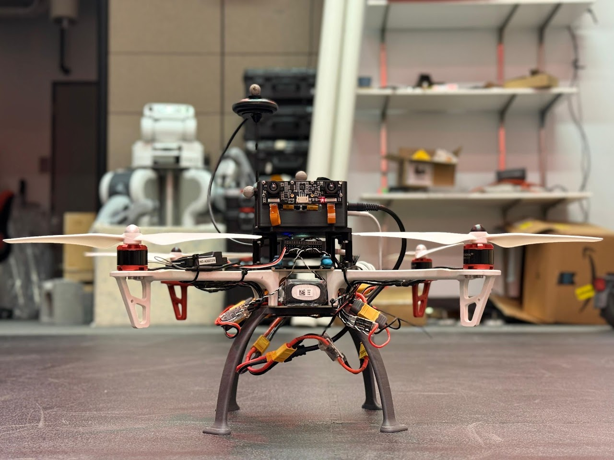
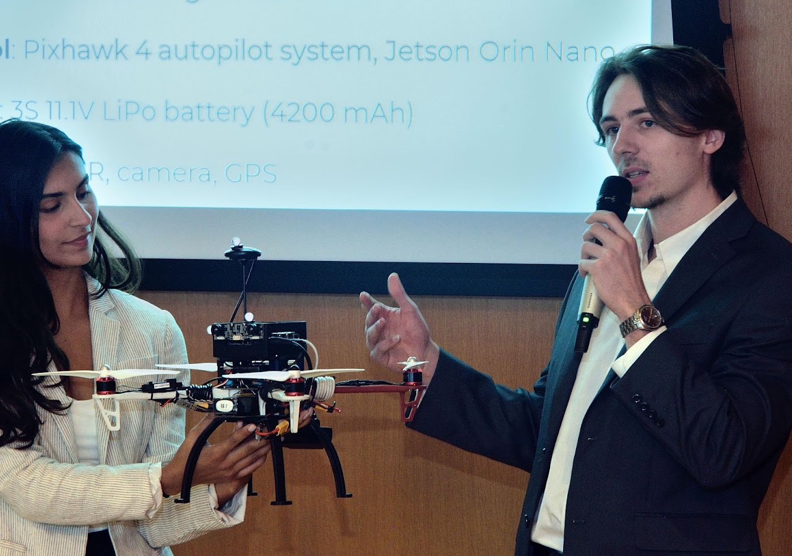
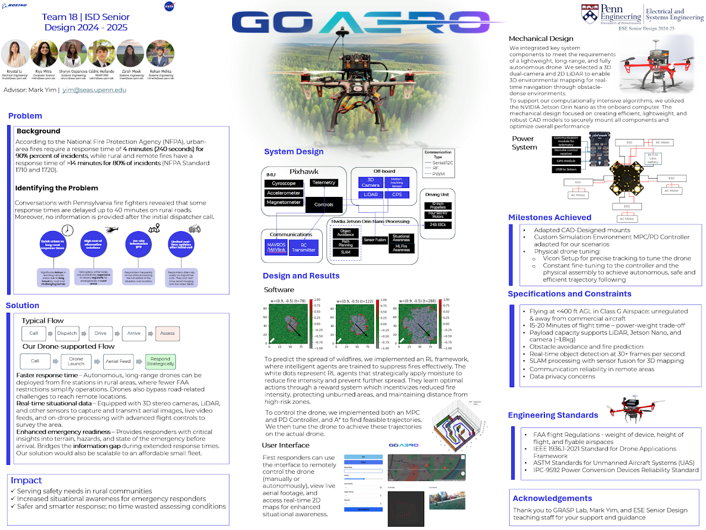

# Senior Capstone: Autonomous Drone in Real-time + Object Detection

<p align="center">
  <a href="https://youtu.be/98ngpQQqQg4">
    
  </a>
  
</p>
<p align="center"><em>Left: **LINK** to the Project Video; Right: Drone Simulation .gif</em></p>


<p align="center">
  
  
</p>
<p align="center"><em>Left: Drone front view; Right: Presentation</em></p>

<p align="center">
  
</p>
<p align="center"><em>Drone Poster</em></p>

  1. Real-time autonomous control of a custom-built drone with Pixhawk and Mavlink.

  2. Customized Firmware to directly control the motors from out controllers.

  3. Tuned the drone with a Vicon Motion Capture system.
  
  4. Experimented with MPC and Geometric PID Controllers, both in sim and on the drone.

  5. Autonomously detect Obstacles and navigate around them.
  
  6. Platform independent web page for autonomously controlling the drone. 

  7. Integrate Jetson Nano Oren with ROS 2, Mavlink and Pixhawk.

  8. Created a Custom Docker image to communicate with Vicon's ROS1 topics (could have also used `ros1_bridge`).


# Instructions to run the drone

## Run the website locally

### Run frontend

Open a terminal and cd into the drone-frontend folder

`cd drone-frontend`

Start the server

`npm start`

You can see the site live at http://localhost:4200/

### Run Backend 

Open another terminal and cd into the `drone_backend` folder 

`cd drone_backend`

Run the shell script to start the backend

`./run.sh`

### Run Fire Simulation

Open another terminala and cd into `fireRL`

`cd fireRL`

Run this command to start the server:

`uvicorn main:app --reload --host 0.0.0.0 --port 8000`

### Run Camera Feed

Open another terminal and cd into `drone_backend`

`cd drone_backend`

Run the camera script:

`python camera_feed.py`


    
## How to Run SITL Gazebo Simulation

In one terminal, open the ardupilot folder

`cd ardupilot/ArduCopter`

Run this command to start SITL:

 `../Tools/autotest/sim_vehicle.py -v ArduCopter -f gazebo-iris --model JSON --map --console`

Then, in another terminal run Gazebo:

`cd gz_ws/src/build`

Run these commands to configure the environment:

`export GZ_SIM_SYSTEM_PLUGIN_PATH=$HOME/gz_ws/src/ardupilot_gazebo/build:$GZ_SIM_SYSTEM_PLUGIN_PATH
export GZ_SIM_RESOURCE_PATH=$HOME/gz_ws/src/ardupilot_gazebo/models:$HOME/gz_ws/src/ardupilot_gazebo/worlds:$GZ_SIM_RESOURCE_PATH`

Finally, run Gazebo

`gz sim -v4 -r iris_runway.sdf`

## How to Run the Docker Environment - to access ROS1

### Intermediary computer (1):
```
. drone_senior_design/devel/setup.bash
roslaunch hawk_tracking vicon_hawk.launch
```

### Intermediary computer (2):
```
. drone_senior_design/devel/setup.bash
rosrun hawk_tracking odom_relay.py
```

### Jetson:
In 2 different terminals:
```
ssh riya@100.77.20.58
sudo docker run -it --network=host --rm --runtime nvidia -e DISPLAY=$DISPLAY -v /tmp/.X11-unix:/tmp/.X11-unix:rw -v /home/riya/drone-control:/workspace --device=/dev/ttyACM0:/dev/ttyACM0 ros_noetic_focal
``` 

In Environment (1):
```
. /workspace/vicon_setup/devel/setup.bash
roscore & rosrun mocap_vicon odom_receiver.py
```

In Environment (2):
```
. /workspace/vicon_setup/devel/setup.bash
cd /workspace/drone-controller/v_1/code/
python3 real_time_quad.py 
```
